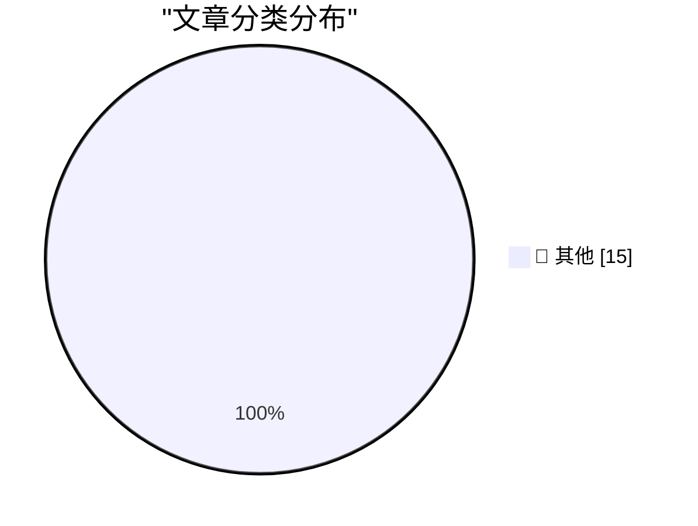

# 📰 AI 博客每日精选 — 2026-10-08

> 来自 Karpathy 推荐的 92 个顶级技术博客，AI 精选 Top 15

## 🏆 今日必读

🥇 **Quoting Ben Affleck**

[Quoting Ben Affleck](https://simonwillison.net/2026/Oct/7/ben-affleck/) — simonwillison.net · 17 小时前 · 📝 其他

> Quoting Ben Affleck

🥈 **Claude Haiku 5.5**

[Claude Haiku 5.5](https://simonwillison.net/2026/Oct/7/claude-haiku-5-5/) — simonwillison.net · 20 小时前 · 📝 其他

> Claude Haiku 5.5

🥉 **Anti-Patterns in Software Blogging**

[Anti-Patterns in Software Blogging](https://simonwillison.net/2026/Oct/7/anti-patterns-in-software-blogging/) — simonwillison.net · 1 天前 · 📝 其他

> Anti-Patterns in Software Blogging

---

## 📊 数据概览

| 扫描源 | 抓取文章 | 时间范围 | 精选 |
|:---:|:---:|:---:|:---:|
| 83/92 | 2347 篇 → 38 篇 | 48h | **15 篇** |

### 分类分布

```mermaid
pie showData
    title "文章分类分布"
    "📝 其他" : 15
```

---

## 📝 其他

### 1. Quoting Ben Affleck

[Quoting Ben Affleck](https://simonwillison.net/2026/Oct/7/ben-affleck/) — **simonwillison.net** · 17 小时前 · ⭐ 15/30

> Quoting Ben Affleck

---

### 2. Claude Haiku 5.5

[Claude Haiku 5.5](https://simonwillison.net/2026/Oct/7/claude-haiku-5-5/) — **simonwillison.net** · 20 小时前 · ⭐ 15/30

> Claude Haiku 5.5

---

### 3. Anti-Patterns in Software Blogging

[Anti-Patterns in Software Blogging](https://simonwillison.net/2026/Oct/7/anti-patterns-in-software-blogging/) — **simonwillison.net** · 1 天前 · ⭐ 15/30

> Anti-Patterns in Software Blogging

---

### 4. Quoting Jake Boggan

[Quoting Jake Boggan](https://simonwillison.net/2026/Oct/7/jake-boggan/) — **simonwillison.net** · 1 天前 · ⭐ 15/30

> Quoting Jake Boggan

---

### 5. OpenAI “rogue” agent activities found on Wikimedia projects

[OpenAI “rogue” agent activities found on Wikimedia projects](https://simonwillison.net/2026/Oct/7/openai-rogue-agents-wikimedia/) — **simonwillison.net** · 1 天前 · ⭐ 15/30

> OpenAI “rogue” agent activities found on Wikimedia projects

---

### 6. Quoting Victoria Kim

[Quoting Victoria Kim](https://simonwillison.net/2026/Oct/6/victoria-kim/) — **simonwillison.net** · 1 天前 · ⭐ 15/30

> Quoting Victoria Kim

---

### 7. llm-openai-decisions 0.1a0

[llm-openai-decisions 0.1a0](https://simonwillison.net/2026/Oct/6/llm-openai-decisions/) — **simonwillison.net** · 1 天前 · ⭐ 15/30

> llm-openai-decisions 0.1a0

---

### 8. llm-mistral 0.16

[llm-mistral 0.16](https://simonwillison.net/2026/Oct/6/llm-mistral/) — **simonwillison.net** · 1 天前 · ⭐ 15/30

> llm-mistral 0.16

---

### 9. EmbeddingGemma 2

[EmbeddingGemma 2](https://simonwillison.net/2026/Oct/6/hn-49983751/) — **simonwillison.net** · 1 天前 · ⭐ 15/30

> EmbeddingGemma 2

---

### 10. Introducing Mistral Large 4: Le chonk

[Introducing Mistral Large 4: Le chonk](https://simonwillison.net/2026/Oct/6/le-chonk/) — **simonwillison.net** · 1 天前 · ⭐ 15/30

> Introducing Mistral Large 4: Le chonk

---

### 11. Using Parseable with Datasette for OpenTelemetry traces

[Using Parseable with Datasette for OpenTelemetry traces](https://simonwillison.net/2026/Oct/6/datasette-parseable-opentelemetry/) — **simonwillison.net** · 1 天前 · ⭐ 15/30

> Using Parseable with Datasette for OpenTelemetry traces

---

### 12. Mistral Large 4

[Mistral Large 4](https://simonwillison.net/2026/Oct/6/hn-49982139/) — **simonwillison.net** · 1 天前 · ⭐ 15/30

> Mistral Large 4

---

### 13. datasette-atom 0.11a0

[datasette-atom 0.11a0](https://simonwillison.net/2026/Oct/6/datasette-atom/) — **simonwillison.net** · 1 天前 · ⭐ 15/30

> datasette-atom 0.11a0

---

### 14. How to read code

[How to read code](https://seangoedecke.com/how-to-read-code/) — **seangoedecke.com** · 1 天前 · ⭐ 15/30

> How to read code

---

### 15. ShinyHunters Extorted Boeing Spin-off Prior to Arrests

[ShinyHunters Extorted Boeing Spin-off Prior to Arrests](https://krebsonsecurity.com/2026/10/shinyhunters-extorted-boeing-spin-off-prior-to-arrests/) — **krebsonsecurity.com** · 1 天前 · ⭐ 15/30

> ShinyHunters Extorted Boeing Spin-off Prior to Arrests

---

*生成于 2026-10-08 17:01 | 扫描 83 源 → 获取 2347 篇 → 精选 15 篇*
*基于 [Hacker News Popularity Contest 2025](https://refactoringenglish.com/tools/hn-popularity/) RSS 源列表，由 [Andrej Karpathy](https://x.com/karpathy) 推荐*
*由「懂点儿AI」制作，欢迎关注同名微信公众号获取更多 AI 实用技巧 💡*
