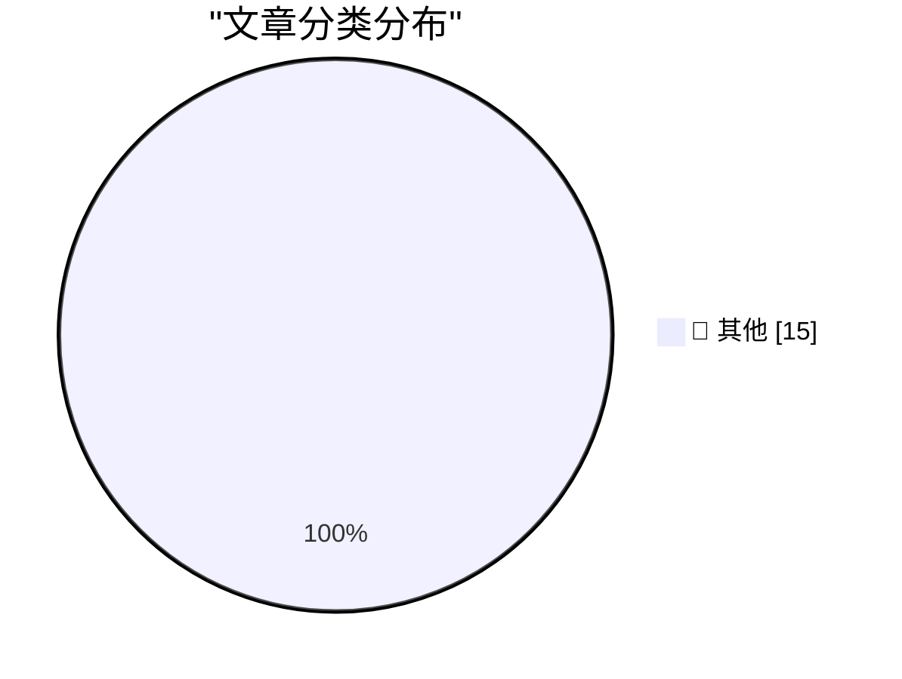

# 📰 AI 博客每日精选 — 2026-10-03

> 来自 Karpathy 推荐的 92 个顶级技术博客，AI 精选 Top 15

## 🏆 今日必读

🥇 **Superpersuasion will look like bribery**

[Superpersuasion will look like bribery](https://seangoedecke.com/superpersuasion-will-look-like-bribery/) — seangoedecke.com · 14 小时前 · 📝 其他

> Superpersuasion will look like bribery

🥈 **Shipping is the foundation**

[Shipping is the foundation](https://seangoedecke.com/shipping-is-the-foundation/) — seangoedecke.com · 14 小时前 · 📝 其他

> Shipping is the foundation

🥉 **Do not build the LLM torture factory**

[Do not build the LLM torture factory](https://seangoedecke.com/do-not-build-the-llm-torture-factory/) — seangoedecke.com · 1 天前 · 📝 其他

> Do not build the LLM torture factory

---

## 📊 数据概览

| 扫描源 | 抓取文章 | 时间范围 | 精选 |
|:---:|:---:|:---:|:---:|
| 82/92 | 2314 篇 → 19 篇 | 48h | **15 篇** |

### 分类分布

```mermaid
pie showData
    title "文章分类分布"
    "📝 其他" : 15
```

---

## 📝 其他

### 1. Superpersuasion will look like bribery

[Superpersuasion will look like bribery](https://seangoedecke.com/superpersuasion-will-look-like-bribery/) — **seangoedecke.com** · 14 小时前 · ⭐ 15/30

> Superpersuasion will look like bribery

---

### 2. Shipping is the foundation

[Shipping is the foundation](https://seangoedecke.com/shipping-is-the-foundation/) — **seangoedecke.com** · 14 小时前 · ⭐ 15/30

> Shipping is the foundation

---

### 3. Do not build the LLM torture factory

[Do not build the LLM torture factory](https://seangoedecke.com/do-not-build-the-llm-torture-factory/) — **seangoedecke.com** · 1 天前 · ⭐ 15/30

> Do not build the LLM torture factory

---

### 4. ★ Apple Is Going to Further Tighten the Screws on Full Disk Access on MacOS, in Response to Agentic AI Apps Running Amok

[★ Apple Is Going to Further Tighten the Screws on Full Disk Access on MacOS, in Response to Agentic AI Apps Running Amok](https://daringfireball.net/2026/10/apple_full_disk_access) — **daringfireball.net** · 17 小时前 · ⭐ 15/30

> ★ Apple Is Going to Further Tighten the Screws on Full Disk Access on MacOS, in Response to Agentic AI Apps Running Amok

---

### 5. Yankees Sweep Boston in Two Games, by Combined Score of 18-2

[Yankees Sweep Boston in Two Games, by Combined Score of 18-2](https://www.nytimes.com/athletic/7648172/2026/09/30/yankees-beat-red-sox-mlb-wild-card-series/) — **daringfireball.net** · 1 天前 · ⭐ 15/30

> Yankees Sweep Boston in Two Games, by Combined Score of 18-2

---

### 6. Pluralistic: Economic probabilities for our grandchildren (03 Oct 2026)

[Pluralistic: Economic probabilities for our grandchildren (03 Oct 2026)](https://pluralistic.net/2026/10/03/full-employment/) — **pluralistic.net** · 2 小时前 · ⭐ 15/30

> Pluralistic: Economic probabilities for our grandchildren (03 Oct 2026)

---

### 7. Pluralistic: Voting is to politics as shopping is to boycotts (01 Oct 2026)

[Pluralistic: Voting is to politics as shopping is to boycotts (01 Oct 2026)](https://pluralistic.net/2026/10/01/data-centers/) — **pluralistic.net** · 1 天前 · ⭐ 15/30

> Pluralistic: Voting is to politics as shopping is to boycotts (01 Oct 2026)

---

### 8. Gadget Review: Una Watch ★★★★☆

[Gadget Review: Una Watch ★★★★☆](https://shkspr.mobi/blog/2026/10/gadget-review-una-watch/) — **shkspr.mobi** · 1 天前 · ⭐ 15/30

> Gadget Review: Una Watch ★★★★☆

---

### 9. Why do OpenAI's GPT-2 weights beat mine?  Part five: data quality

[Why do OpenAI's GPT-2 weights beat mine?  Part five: data quality](https://www.gilesthomas.com/2026/10/why-do-openai-gpt2-weights-beat-mine-5-data-quality) — **gilesthomas.com** · 1 天前 · ⭐ 15/30

> Why do OpenAI's GPT-2 weights beat mine?  Part five: data quality

---

### 10. The Brain Sandwich

[The Brain Sandwich](https://terriblesoftware.org/2026/10/02/the-brain-sandwich/) — **terriblesoftware.org** · 1 天前 · ⭐ 15/30

> The Brain Sandwich

---

### 11. This Week in Package Management: 3 October 2026

[This Week in Package Management: 3 October 2026](https://nesbitt.io/2026/10/03/this-week-in-package-management.html) — **nesbitt.io** · 4 小时前 · ⭐ 15/30

> This Week in Package Management: 3 October 2026

---

### 12. Reading List 2026-10-03

[Reading List 2026-10-03](https://www.construction-physics.com/p/reading-list-2026-10-03) — **construction-physics.com** · 1 小时前 · ⭐ 15/30

> Reading List 2026-10-03

---

### 13. Si Sheppard – How did a few hundred Spanish soldiers topple two empires?

[Si Sheppard – How did a few hundred Spanish soldiers topple two empires?](https://www.dwarkesh.com/p/si-sheppard) — **dwarkesh.com** · 1 天前 · ⭐ 15/30

> Si Sheppard – How did a few hundred Spanish soldiers topple two empires?

---

### 14. Premium: How Has AI Changed The Economy?

[Premium: How Has AI Changed The Economy?](https://www.wheresyoured.at/premium-how-has-ai-changed-the-economy/) — **wheresyoured.at** · 19 小时前 · ⭐ 15/30

> Premium: How Has AI Changed The Economy?

---

### 15. Cull lumber at Menards

[Cull lumber at Menards](https://dfarq.homeip.net/cull-lumber-at-menards/?utm_source=rss&#038;utm_medium=rss&#038;utm_campaign=cull-lumber-at-menards) — **dfarq.homeip.net** · 3 小时前 · ⭐ 15/30

> Cull lumber at Menards

---

*生成于 2026-10-03 14:27 | 扫描 82 源 → 获取 2314 篇 → 精选 15 篇*
*基于 [Hacker News Popularity Contest 2025](https://refactoringenglish.com/tools/hn-popularity/) RSS 源列表，由 [Andrej Karpathy](https://x.com/karpathy) 推荐*
*由「懂点儿AI」制作，欢迎关注同名微信公众号获取更多 AI 实用技巧 💡*
