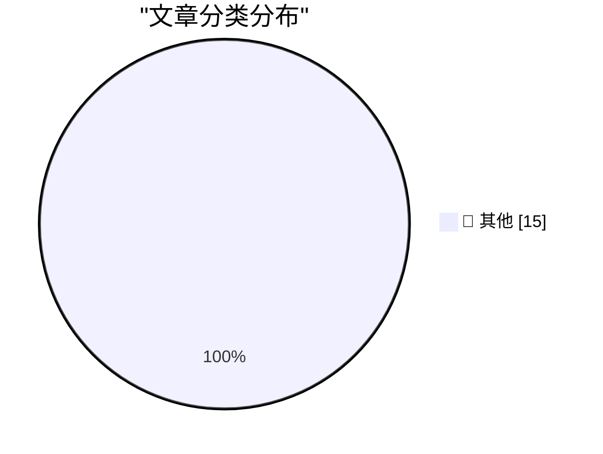

# 📰 AI 博客每日精选 — 2026-10-06

> 来自 Karpathy 推荐的 92 个顶级技术博客，AI 精选 Top 15

## 🏆 今日必读

🥇 **Scrimshaw Jukebox**

[Scrimshaw Jukebox](https://simonwillison.net/2026/Oct/6/scrimshaw-jukebox/) — simonwillison.net · 1 小时前 · 📝 其他

> Scrimshaw Jukebox

🥈 **Quoting Felix Rieseberg**

[Quoting Felix Rieseberg](https://simonwillison.net/2026/Oct/5/felix-rieseberg/) — simonwillison.net · 16 小时前 · 📝 其他

> Quoting Felix Rieseberg

🥉 **Qwen3.8 27B addition in words**

[Qwen3.8 27B addition in words](https://simonwillison.net/2026/Oct/4/qwen38-addition-in-words/) — simonwillison.net · 1 天前 · 📝 其他

> Qwen3.8 27B addition in words

---

## 📊 数据概览

| 扫描源 | 抓取文章 | 时间范围 | 精选 |
|:---:|:---:|:---:|:---:|
| 83/92 | 2344 篇 → 24 篇 | 48h | **15 篇** |

### 分类分布

```mermaid
pie showData
    title "文章分类分布"
    "📝 其他" : 15
```

---

## 📝 其他

### 1. Scrimshaw Jukebox

[Scrimshaw Jukebox](https://simonwillison.net/2026/Oct/6/scrimshaw-jukebox/) — **simonwillison.net** · 1 小时前 · ⭐ 15/30

> Scrimshaw Jukebox

---

### 2. Quoting Felix Rieseberg

[Quoting Felix Rieseberg](https://simonwillison.net/2026/Oct/5/felix-rieseberg/) — **simonwillison.net** · 16 小时前 · ⭐ 15/30

> Quoting Felix Rieseberg

---

### 3. Qwen3.8 27B addition in words

[Qwen3.8 27B addition in words](https://simonwillison.net/2026/Oct/4/qwen38-addition-in-words/) — **simonwillison.net** · 1 天前 · ⭐ 15/30

> Qwen3.8 27B addition in words

---

### 4. Steve Jobs, Walking Through a Mockup for Apple Park in 2010

[Steve Jobs, Walking Through a Mockup for Apple Park in 2010](https://book.stevejobsarchive.com/#photo-37) — **daringfireball.net** · 13 小时前 · ⭐ 15/30

> Steve Jobs, Walking Through a Mockup for Apple Park in 2010

---

### 5. [Sponsor] Sunnny

[[Sponsor] Sunnny](https://sunnny.com/) — **daringfireball.net** · 16 小时前 · ⭐ 15/30

> [Sponsor] Sunnny

---

### 6. OpenAI Announces Their Text Watermarking Plans

[OpenAI Announces Their Text Watermarking Plans](https://openai.com/index/eu-text-provenance/) — **daringfireball.net** · 17 小时前 · ⭐ 15/30

> OpenAI Announces Their Text Watermarking Plans

---

### 7. Ternus and Cook Tweet Brief Remembrances on the 15th Anniversary of Steve Jobs’s Death

[Ternus and Cook Tweet Brief Remembrances on the 15th Anniversary of Steve Jobs’s Death](https://x.com/johnternus/status/2107093462118199562) — **daringfireball.net** · 21 小时前 · ⭐ 15/30

> Ternus and Cook Tweet Brief Remembrances on the 15th Anniversary of Steve Jobs’s Death

---

### 8. Pluralistic: Swapping money for expertise (06 Oct 2026)

[Pluralistic: Swapping money for expertise (06 Oct 2026)](https://pluralistic.net/2026/10/06/nonfungible/) — **pluralistic.net** · 3 小时前 · ⭐ 15/30

> Pluralistic: Swapping money for expertise (06 Oct 2026)

---

### 9. Pluralistic: Scrutinized (05 Oct 2026)

[Pluralistic: Scrutinized (05 Oct 2026)](https://pluralistic.net/2026/10/05/pervert-glasses/) — **pluralistic.net** · 21 小时前 · ⭐ 15/30

> Pluralistic: Scrutinized (05 Oct 2026)

---

### 10. Una Watch - SDK and Writing Your First App

[Una Watch - SDK and Writing Your First App](https://shkspr.mobi/blog/2026/10/una-watch-sdk-and-writing-your-first-app/) — **shkspr.mobi** · 4 小时前 · ⭐ 15/30

> Una Watch - SDK and Writing Your First App

---

### 11. [RSS Club] Changes to the RSS and Atom feeds

[[RSS Club] Changes to the RSS and Atom feeds](https://shkspr.mobi/blog/2026/10/rss-club-changes-to-the-rss-and-atom-feeds/) — **shkspr.mobi** · 1 天前 · ⭐ 15/30

> [RSS Club] Changes to the RSS and Atom feeds

---

### 12. If somebody tries to hot-patch an already-hot-patched function, how do they avoid conflicts?

[If somebody tries to hot-patch an already-hot-patched function, how do they avoid conflicts?](https://devblogs.microsoft.com/oldnewthing/20261005-00/?p=112755/) — **devblogs.microsoft.com/oldnewthing** · 1 天前 · ⭐ 15/30

> If somebody tries to hot-patch an already-hot-patched function, how do they avoid conflicts?

---

### 13. What is Codemode

[What is Codemode](https://lucumr.pocoo.org/2026/10/6/codemode/) — **lucumr.pocoo.org** · 16 小时前 · ⭐ 15/30

> What is Codemode

---

### 14. Benchmark In Milliseconds

[Benchmark In Milliseconds](https://matklad.github.io/2026/10/05/benchmark-milliseconds.html) — **matklad.github.io** · 1 天前 · ⭐ 15/30

> Benchmark In Milliseconds

---

### 15. Missing Link

[Missing Link](https://feed.tedium.co/link/15204/17490109/link-newspaper-virginian-pilot-remembrance) — **tedium.co** · 13 小时前 · ⭐ 15/30

> Missing Link

---

*生成于 2026-10-06 16:20 | 扫描 83 源 → 获取 2344 篇 → 精选 15 篇*
*基于 [Hacker News Popularity Contest 2025](https://refactoringenglish.com/tools/hn-popularity/) RSS 源列表，由 [Andrej Karpathy](https://x.com/karpathy) 推荐*
*由「懂点儿AI」制作，欢迎关注同名微信公众号获取更多 AI 实用技巧 💡*
