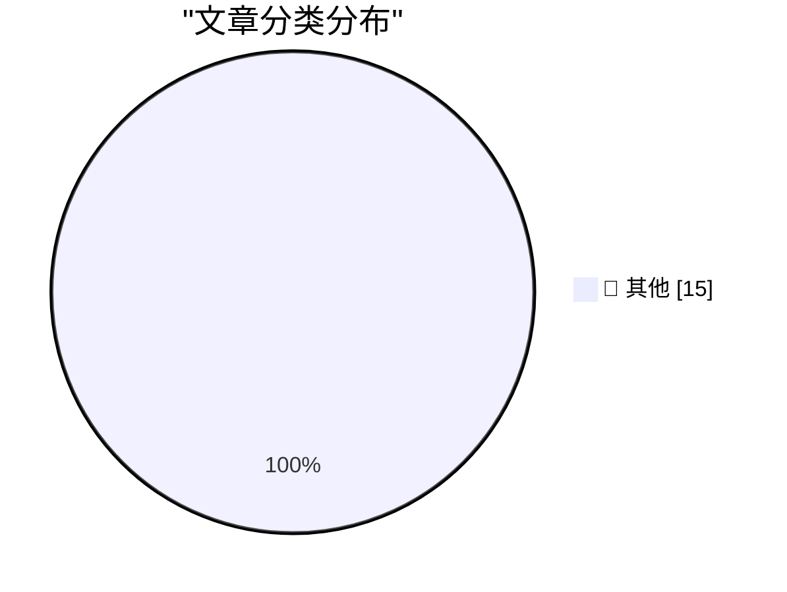

# 📰 AI 博客每日精选 — 2026-10-10

> 来自 Karpathy 推荐的 92 个顶级技术博客，AI 精选 Top 15

## 🏆 今日必读

🥇 **Quoting The New York Times**

[Quoting The New York Times](https://simonwillison.net/2026/Oct/10/the-new-york-times/) — simonwillison.net · 13 小时前 · 📝 其他

> Quoting The New York Times

🥈 **Deno is joining Cloudflare**

[Deno is joining Cloudflare](https://simonwillison.net/2026/Oct/9/deno-is-joining-cloudflare/) — simonwillison.net · 16 小时前 · 📝 其他

> Deno is joining Cloudflare

🥉 **Quoting Matthew Green**

[Quoting Matthew Green](https://simonwillison.net/2026/Oct/9/matthew-green/) — simonwillison.net · 1 天前 · 📝 其他

> Quoting Matthew Green

---

## 📊 数据概览

| 扫描源 | 抓取文章 | 时间范围 | 精选 |
|:---:|:---:|:---:|:---:|
| 79/92 | 2252 篇 → 29 篇 | 48h | **15 篇** |

### 分类分布

```mermaid
pie showData
    title "文章分类分布"
    "📝 其他" : 15
```

---

## 📝 其他

### 1. Quoting The New York Times

[Quoting The New York Times](https://simonwillison.net/2026/Oct/10/the-new-york-times/) — **simonwillison.net** · 13 小时前 · ⭐ 15/30

> Quoting The New York Times

---

### 2. Deno is joining Cloudflare

[Deno is joining Cloudflare](https://simonwillison.net/2026/Oct/9/deno-is-joining-cloudflare/) — **simonwillison.net** · 16 小时前 · ⭐ 15/30

> Deno is joining Cloudflare

---

### 3. Quoting Matthew Green

[Quoting Matthew Green](https://simonwillison.net/2026/Oct/9/matthew-green/) — **simonwillison.net** · 1 天前 · ⭐ 15/30

> Quoting Matthew Green

---

### 4. A new feature for my blog, built using my voice

[A new feature for my blog, built using my voice](https://simonwillison.net/2026/Oct/9/built-using-my-voice/) — **simonwillison.net** · 1 天前 · ⭐ 15/30

> A new feature for my blog, built using my voice

---

### 5. ttok 1.0

[ttok 1.0](https://simonwillison.net/2026/Oct/9/ttok/) — **simonwillison.net** · 1 天前 · ⭐ 15/30

> ttok 1.0

---

### 6. ttok 0.4

[ttok 0.4](https://simonwillison.net/2026/Oct/8/ttok/) — **simonwillison.net** · 1 天前 · ⭐ 15/30

> ttok 0.4

---

### 7. Quoting Carson Gross

[Quoting Carson Gross](https://simonwillison.net/2026/Oct/8/carson-gross/) — **simonwillison.net** · 1 天前 · ⭐ 15/30

> Quoting Carson Gross

---

### 8. Radxa's Q8B has 2x the performance and expansion of the Pi 5

[Radxa's Q8B has 2x the performance and expansion of the Pi 5](https://www.jeffgeerling.com/blog/2026/radxa-q8b-double-pi-5/) — **jeffgeerling.com** · 19 小时前 · ⭐ 15/30

> Radxa's Q8B has 2x the performance and expansion of the Pi 5

---

### 9. Software's centaur age may last decades

[Software's centaur age may last decades](https://seangoedecke.com/softwares-centaur-age-may-last-decades/) — **seangoedecke.com** · 15 小时前 · ⭐ 15/30

> Software's centaur age may last decades

---

### 10. FBI Arrests Executive at Ransomware Negotiation Firm

[FBI Arrests Executive at Ransomware Negotiation Firm](https://krebsonsecurity.com/2026/10/fbi-arrests-founder-of-ransomware-negotiation-firm/) — **krebsonsecurity.com** · 15 小时前 · ⭐ 15/30

> FBI Arrests Executive at Ransomware Negotiation Firm

---

### 11. Let’s Check In on Trump’s Blog

[Let’s Check In on Trump’s Blog](https://truthsocial.com/@realDonaldTrump/posts/117406176604364910) — **daringfireball.net** · 1 天前 · ⭐ 15/30

> Let’s Check In on Trump’s Blog

---

### 12. Apple Is Slow-Rolling iOS 27 Adoption, So Far

[Apple Is Slow-Rolling iOS 27 Adoption, So Far](https://mastodon.social/@_Davidsmith/117355154519434137) — **daringfireball.net** · 1 天前 · ⭐ 15/30

> Apple Is Slow-Rolling iOS 27 Adoption, So Far

---

### 13. Joz Announces ‘Welcome Home’ Keynote Coming Tuesday, 13 October

[Joz Announces ‘Welcome Home’ Keynote Coming Tuesday, 13 October](https://x.com/gregjoz/status/2108226096407994858) — **daringfireball.net** · 1 天前 · ⭐ 15/30

> Joz Announces ‘Welcome Home’ Keynote Coming Tuesday, 13 October

---

### 14. 20 Minutes of Political Debate, Brought to You by Commercial Breaks

[20 Minutes of Political Debate, Brought to You by Commercial Breaks](https://idiallo.com/byte-size/20-minutes-of-political-debate) — **idiallo.com** · 1 天前 · ⭐ 15/30

> 20 Minutes of Political Debate, Brought to You by Commercial Breaks

---

### 15. Pluralistic: Thwarted (09 Oct 2026)

[Pluralistic: Thwarted (09 Oct 2026)](https://pluralistic.net/2026/10/09/impunitism/) — **pluralistic.net** · 19 小时前 · ⭐ 15/30

> Pluralistic: Thwarted (09 Oct 2026)

---

*生成于 2026-10-10 15:37 | 扫描 79 源 → 获取 2252 篇 → 精选 15 篇*
*基于 [Hacker News Popularity Contest 2025](https://refactoringenglish.com/tools/hn-popularity/) RSS 源列表，由 [Andrej Karpathy](https://x.com/karpathy) 推荐*
*由「懂点儿AI」制作，欢迎关注同名微信公众号获取更多 AI 实用技巧 💡*
