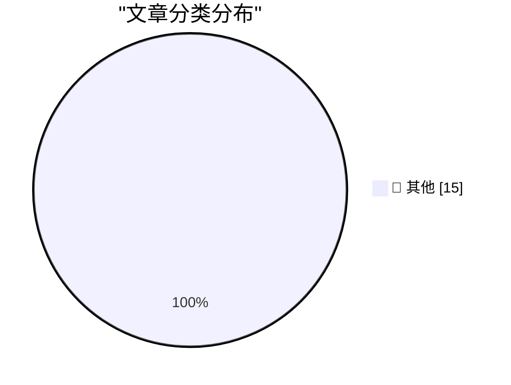

# 📰 AI 博客每日精选 — 2026-10-04

> 来自 Karpathy 推荐的 92 个顶级技术博客，AI 精选 Top 15

## 🏆 今日必读

🥇 **We're going to need default hard budget caps on pretty much everything**

[We're going to need default hard budget caps on pretty much everything](https://simonwillison.net/2026/Oct/3/default-hard-budget-caps/) — simonwillison.net · 15 小时前 · 📝 其他

> We're going to need default hard budget caps on pretty much everything

🥈 **September sponsors-only newsletter**

[September sponsors-only newsletter](https://simonwillison.net/2026/Oct/3/newsletter/) — simonwillison.net · 17 小时前 · 📝 其他

> September sponsors-only newsletter

🥉 **Rex's Dino Store**

[Rex's Dino Store](https://simonwillison.net/2026/Oct/2/rex-s-dino-store/) — simonwillison.net · 1 天前 · 📝 其他

> Rex's Dino Store

---

## 📊 数据概览

| 扫描源 | 抓取文章 | 时间范围 | 精选 |
|:---:|:---:|:---:|:---:|
| 82/92 | 2314 篇 → 24 篇 | 48h | **15 篇** |

### 分类分布

```mermaid
pie showData
    title "文章分类分布"
    "📝 其他" : 15
```

---

## 📝 其他

### 1. We're going to need default hard budget caps on pretty much everything

[We're going to need default hard budget caps on pretty much everything](https://simonwillison.net/2026/Oct/3/default-hard-budget-caps/) — **simonwillison.net** · 15 小时前 · ⭐ 15/30

> We're going to need default hard budget caps on pretty much everything

---

### 2. September sponsors-only newsletter

[September sponsors-only newsletter](https://simonwillison.net/2026/Oct/3/newsletter/) — **simonwillison.net** · 17 小时前 · ⭐ 15/30

> September sponsors-only newsletter

---

### 3. Rex's Dino Store

[Rex's Dino Store](https://simonwillison.net/2026/Oct/2/rex-s-dino-store/) — **simonwillison.net** · 1 天前 · ⭐ 15/30

> Rex's Dino Store

---

### 4. Superpersuasion will look like bribery

[Superpersuasion will look like bribery](https://seangoedecke.com/superpersuasion-will-look-like-bribery/) — **seangoedecke.com** · 1 天前 · ⭐ 15/30

> Superpersuasion will look like bribery

---

### 5. Shipping is the foundation

[Shipping is the foundation](https://seangoedecke.com/shipping-is-the-foundation/) — **seangoedecke.com** · 1 天前 · ⭐ 15/30

> Shipping is the foundation

---

### 6. WorkOS

[WorkOS](https://workos.com/guide/the-developers-guide-to-sso?utm_source=daringfireball&amp;utm_medium=newsletter&amp;utm_campaign=q32026) — **daringfireball.net** · 17 小时前 · ⭐ 15/30

> WorkOS

---

### 7. Apple Confirms iPhone 18 Pro Max AT&T Cellular Issues, Affected Devices Require Hardware Replacement

[Apple Confirms iPhone 18 Pro Max AT&T Cellular Issues, Affected Devices Require Hardware Replacement](https://9to5mac.com/2026/10/02/apple-confirms-iphone-18-pro-max-att-cellular-issues-affected-devices-require-hardware-replacement/) — **daringfireball.net** · 20 小时前 · ⭐ 15/30

> Apple Confirms iPhone 18 Pro Max AT&T Cellular Issues, Affected Devices Require Hardware Replacement

---

### 8. ★ Apple Is Going to Further Tighten the Screws on Full Disk Access on MacOS, in Response to Agentic AI Apps Running Amok

[★ Apple Is Going to Further Tighten the Screws on Full Disk Access on MacOS, in Response to Agentic AI Apps Running Amok](https://daringfireball.net/2026/10/apple_full_disk_access) — **daringfireball.net** · 1 天前 · ⭐ 15/30

> ★ Apple Is Going to Further Tighten the Screws on Full Disk Access on MacOS, in Response to Agentic AI Apps Running Amok

---

### 9. Why My Asus Laptop Kept Rebooting After Sleep and How to Fix it

[Why My Asus Laptop Kept Rebooting After Sleep and How to Fix it](https://idiallo.com/blog/asus-laptop-keeps-rebooting-after-sleep) — **idiallo.com** · 12 小时前 · ⭐ 15/30

> Why My Asus Laptop Kept Rebooting After Sleep and How to Fix it

---

### 10. Pluralistic: Economic probabilities for our grandchildren (03 Oct 2026)

[Pluralistic: Economic probabilities for our grandchildren (03 Oct 2026)](https://pluralistic.net/2026/10/03/full-employment/) — **pluralistic.net** · 1 天前 · ⭐ 15/30

> Pluralistic: Economic probabilities for our grandchildren (03 Oct 2026)

---

### 11. My Pitch for the New Season of Doctor Who

[My Pitch for the New Season of Doctor Who](https://shkspr.mobi/blog/2026/10/my-pitch-for-the-new-season-of-doctor-who/) — **shkspr.mobi** · 3 小时前 · ⭐ 15/30

> My Pitch for the New Season of Doctor Who

---

### 12. Miquel’s pentagon theorem

[Miquel’s pentagon theorem](https://www.johndcook.com/blog/2026/10/04/miquels-pentagon-theorem/) — **johndcook.com** · 2 小时前 · ⭐ 15/30

> Miquel’s pentagon theorem

---

### 13. Topological models of modal logic

[Topological models of modal logic](https://www.johndcook.com/blog/2026/10/04/topological-models-of-modal-logic/) — **johndcook.com** · 2 小时前 · ⭐ 15/30

> Topological models of modal logic

---

### 14. Modal logic and topology

[Modal logic and topology](https://www.johndcook.com/blog/2026/10/04/modal-topology/) — **johndcook.com** · 2 小时前 · ⭐ 15/30

> Modal logic and topology

---

### 15. Miquel’s pivot theorem

[Miquel’s pivot theorem](https://www.johndcook.com/blog/2026/10/03/miquels-pivot-theorem/) — **johndcook.com** · 16 小时前 · ⭐ 15/30

> Miquel’s pivot theorem

---

*生成于 2026-10-04 15:01 | 扫描 82 源 → 获取 2314 篇 → 精选 15 篇*
*基于 [Hacker News Popularity Contest 2025](https://refactoringenglish.com/tools/hn-popularity/) RSS 源列表，由 [Andrej Karpathy](https://x.com/karpathy) 推荐*
*由「懂点儿AI」制作，欢迎关注同名微信公众号获取更多 AI 实用技巧 💡*
