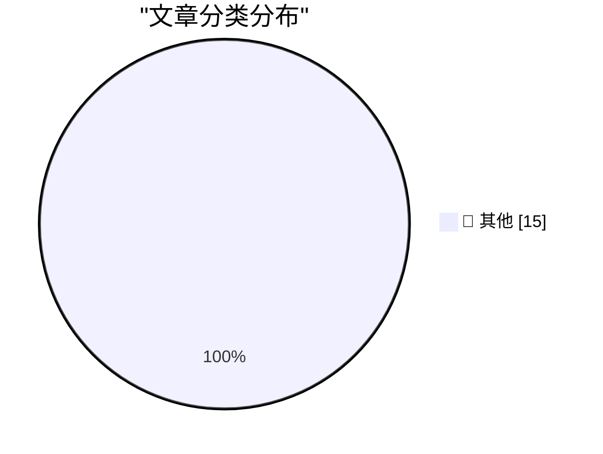

# 📰 AI 博客每日精选 — 2026-09-30

> 来自 Karpathy 推荐的 92 个顶级技术博客，AI 精选 Top 15

## 🏆 今日必读

🥇 **Quoting Anthropic Frontier Red Team**

[Quoting Anthropic Frontier Red Team](https://simonwillison.net/2026/Sep/29/anthropic-frontier-red-team/) — simonwillison.net · 17 小时前 · 📝 其他

> Quoting Anthropic Frontier Red Team

🥈 **GPT 6.1 Sol: Near-Astra intelligence for a fifth of the price**

[GPT 6.1 Sol: Near-Astra intelligence for a fifth of the price](https://simonwillison.net/2026/Sep/29/hn-49898129/) — simonwillison.net · 21 小时前 · 📝 其他

> GPT 6.1 Sol: Near-Astra intelligence for a fifth of the price

🥉 **Photo Scrubber — local face blur & metadata removal**

[Photo Scrubber — local face blur & metadata removal](https://simonwillison.net/2026/Sep/29/photo-scrubber/) — simonwillison.net · 23 小时前 · 📝 其他

> Photo Scrubber — local face blur & metadata removal

---

## 📊 数据概览

| 扫描源 | 抓取文章 | 时间范围 | 精选 |
|:---:|:---:|:---:|:---:|
| 83/92 | 2343 篇 → 34 篇 | 48h | **15 篇** |

### 分类分布

```mermaid
pie showData
    title "文章分类分布"
    "📝 其他" : 15
```

---

## 📝 其他

### 1. Quoting Anthropic Frontier Red Team

[Quoting Anthropic Frontier Red Team](https://simonwillison.net/2026/Sep/29/anthropic-frontier-red-team/) — **simonwillison.net** · 17 小时前 · ⭐ 15/30

> Quoting Anthropic Frontier Red Team

---

### 2. GPT 6.1 Sol: Near-Astra intelligence for a fifth of the price

[GPT 6.1 Sol: Near-Astra intelligence for a fifth of the price](https://simonwillison.net/2026/Sep/29/hn-49898129/) — **simonwillison.net** · 21 小时前 · ⭐ 15/30

> GPT 6.1 Sol: Near-Astra intelligence for a fifth of the price

---

### 3. Photo Scrubber — local face blur & metadata removal

[Photo Scrubber — local face blur & metadata removal](https://simonwillison.net/2026/Sep/29/photo-scrubber/) — **simonwillison.net** · 23 小时前 · ⭐ 15/30

> Photo Scrubber — local face blur & metadata removal

---

### 4. OpenAI DevDay 2026 live blog

[OpenAI DevDay 2026 live blog](https://simonwillison.net/2026/Sep/29/openai-devday-2026-live-blog/) — **simonwillison.net** · 1 天前 · ⭐ 15/30

> OpenAI DevDay 2026 live blog

---

### 5. Claude Sonnet 5.5

[Claude Sonnet 5.5](https://simonwillison.net/2026/Sep/28/claude-sonnet-5-5/) — **simonwillison.net** · 1 天前 · ⭐ 15/30

> Claude Sonnet 5.5

---

### 6. Quoting @joedaroo

[Quoting @joedaroo](https://simonwillison.net/2026/Sep/28/joedaroo/) — **simonwillison.net** · 1 天前 · ⭐ 15/30

> Quoting @joedaroo

---

### 7. Follow-Up on my Spitballed Predictions for Apple’s October

[Follow-Up on my Spitballed Predictions for Apple’s October](https://daringfireball.net/2026/09/spitballing_predictions_for_apples_october) — **daringfireball.net** · 1 天前 · ⭐ 15/30

> Follow-Up on my Spitballed Predictions for Apple’s October

---

### 8. Destroy Any Website

[Destroy Any Website](https://destroy.spritefusion.com/) — **daringfireball.net** · 1 天前 · ⭐ 15/30

> Destroy Any Website

---

### 9. Bastardica

[Bastardica](https://bastardica.mitpit.com/) — **daringfireball.net** · 1 天前 · ⭐ 15/30

> Bastardica

---

### 10. ‘When Did Google Get So F-Ing Weird?’

[‘When Did Google Get So F-Ing Weird?’](https://sancho.bearblog.dev/google-weird/) — **daringfireball.net** · 1 天前 · ⭐ 15/30

> ‘When Did Google Get So F-Ing Weird?’

---

### 11. Joanna Stern Pokes the Pickle

[Joanna Stern Pokes the Pickle](https://www.youtube.com/watch?v=YNqYEMuoQAI) — **daringfireball.net** · 1 天前 · ⭐ 15/30

> Joanna Stern Pokes the Pickle

---

### 12. ‘Donald Decodes’ Interview Craig Federighi Regarding the iPhone Duo

[‘Donald Decodes’ Interview Craig Federighi Regarding the iPhone Duo](https://www.youtube.com/watch?v=y227RF0smAg) — **daringfireball.net** · 1 天前 · ⭐ 15/30

> ‘Donald Decodes’ Interview Craig Federighi Regarding the iPhone Duo

---

### 13. Why Stolen Device Protection Makes Passwords Safer

[Why Stolen Device Protection Makes Passwords Safer](https://sixcolors.com/post/2026/09/stolen-device-protection-passwords-glenn/) — **daringfireball.net** · 1 天前 · ⭐ 15/30

> Why Stolen Device Protection Makes Passwords Safer

---

### 14. Jeremy Stern’s Profile of Mark Zuckerberg for Colossus

[Jeremy Stern’s Profile of Mark Zuckerberg for Colossus](https://colossus.com/article/mark-zuckerberg-profile/) — **daringfireball.net** · 1 天前 · ⭐ 15/30

> Jeremy Stern’s Profile of Mark Zuckerberg for Colossus

---

### 15. Muse, Instagram, and VLC Lookalike Rip-Offs in the Mac App Store

[Muse, Instagram, and VLC Lookalike Rip-Offs in the Mac App Store](https://lapcatsoftware.com/articles/2026/9/8.html) — **daringfireball.net** · 1 天前 · ⭐ 15/30

> Muse, Instagram, and VLC Lookalike Rip-Offs in the Mac App Store

---

*生成于 2026-09-30 16:09 | 扫描 83 源 → 获取 2343 篇 → 精选 15 篇*
*基于 [Hacker News Popularity Contest 2025](https://refactoringenglish.com/tools/hn-popularity/) RSS 源列表，由 [Andrej Karpathy](https://x.com/karpathy) 推荐*
*由「懂点儿AI」制作，欢迎关注同名微信公众号获取更多 AI 实用技巧 💡*
